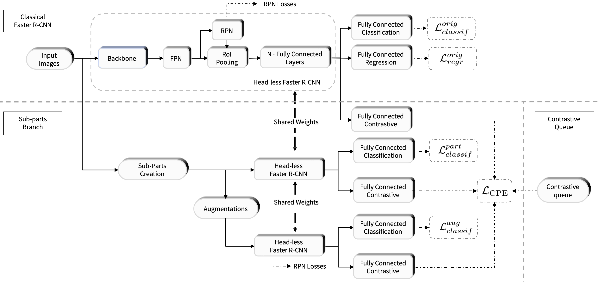

## Introduction

Few-shot object detection on remote sensing images for DIOR horizontal bounding boxes using contrastive Faster R-CNN with Sub-Parts 
.

Based on MMDetection object detection toolbox based on PyTorch which is
a part of the [OpenMMLab](https://openmmlab.com/) project.
This repo also depends of the computer vision library [mmcv](https://github.com/open-mmlab/mmcv)
The master branch works with **PyTorch 1.5+**.


## Installation

Please refer to [Installation](get_started.md/#Installation) for installation instructions.

## Getting Started

Please see [get_started.md](get_started.md) for the basic usage of this repo. 

## Adding CometML hook
In the setup file, configs/tfa/../...py add:
log_config = dict(
  interval=50,
  hooks=[
      dict(type='CometMLLoggerHook', 
          project_name='logger_comet_ml',
          api_key= ‘your-api-key’)
  ])
## Contributing

We appreciate all contributions to improve MMDetection. Ongoing projects can be found in out [GitHub Projects](https://github.com/open-mmlab/mmdetection/projects). Welcome community users to participate in these projects. Please refer to [CONTRIBUTING.md](.github/CONTRIBUTING.md) for the contributing guideline.

## Acknowledgement

MMDetection is an open source project that is contributed by researchers and engineers from various colleges and companies. We appreciate all the contributors who implement their methods or add new features, as well as users who give valuable feedbacks.
We wish that the toolbox and benchmark could serve the growing research community by providing a flexible toolkit to reimplement existing methods and develop their own new detectors.

## Citation

The toolbox are from MMDetection project.

```
@article{mmdetection,
  title   = {{MMDetection}: Open MMLab Detection Toolbox and Benchmark},
  author  = {Chen, Kai and Wang, Jiaqi and Pang, Jiangmiao and Cao, Yuhang and
             Xiong, Yu and Li, Xiaoxiao and Sun, Shuyang and Feng, Wansen and
             Liu, Ziwei and Xu, Jiarui and Zhang, Zheng and Cheng, Dazhi and
             Zhu, Chenchen and Cheng, Tianheng and Zhao, Qijie and Li, Buyu and
             Lu, Xin and Zhu, Rui and Wu, Yue and Dai, Jifeng and Wang, Jingdong
             and Shi, Jianping and Ouyang, Wanli and Loy, Chen Change and Lin, Dahua},
  journal= {arXiv preprint arXiv:1906.07155},
  year={2019}
}
```

## License

This project is released under the [Apache 2.0 license](LICENSE).